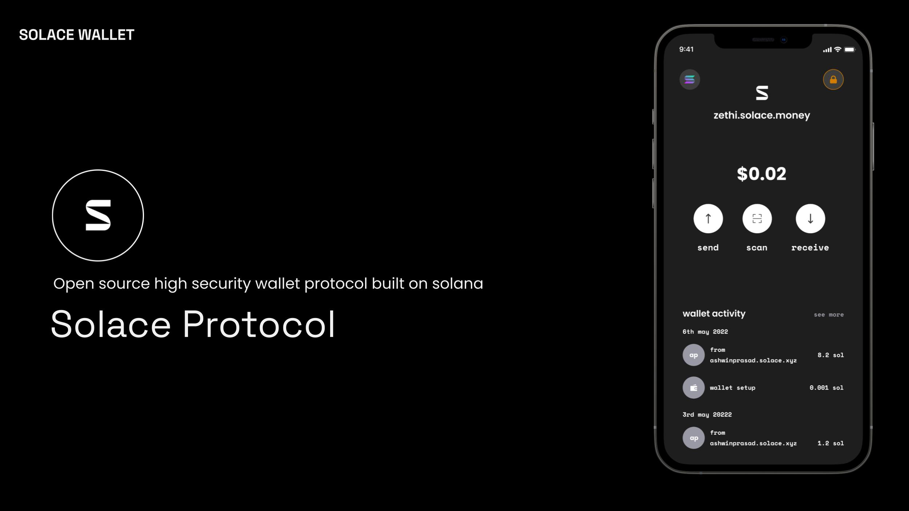
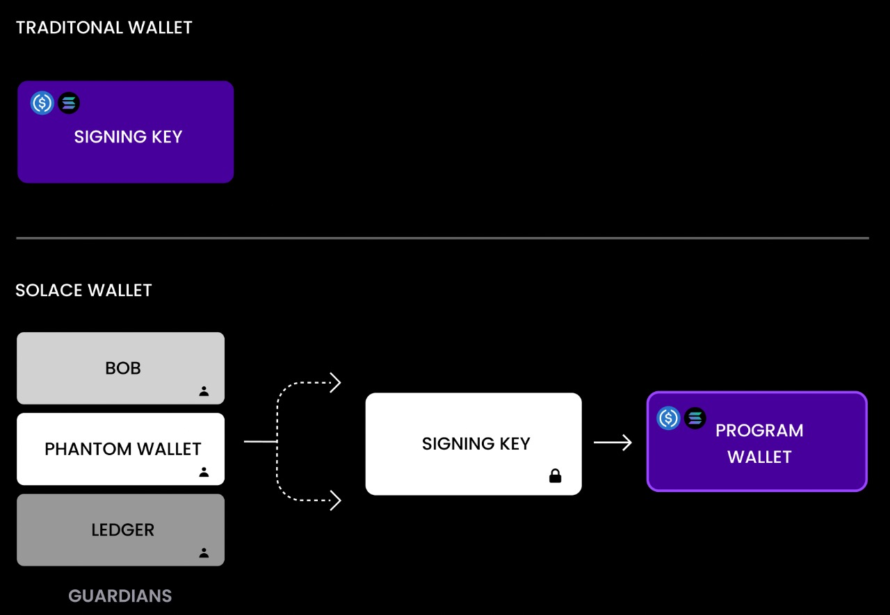

# Solace Wallet

Solace is a program (smart-contract) based non-custodial wallet for Solana which eases user's onboarding and enhances security using social recovery, written in Rust.

Program Address (Testnet) - `8FRYfiEcSPFuJd27jkKaPBwFCiXDFYrnfwqgH9JFjS2U`

### The Problem

Seed Phrases deter mass adoption of crypto wallets.
Users tend to lose their seed phrases or they are a vector of attack by hackers. Having a single point of failure for user's funds, was never a good thing.

Social recovery based smart-contract / program wallets are the way of the future. They remove barrier to adoption by making seed-phrases a thing of the past and provide multiple layers of security to the user's funds.

### How does it work

1. User creates a Solace Program Wallet Account, signed by a Keypair generated for them
2. This signing keypair becomes the owner of the Program Wallet and is required for signing any transaction
3. The user then adds guardians to guard the Program Wallet. These guardians can be friends / family or other wallets the user has access to (Phantom, Ledger, ...)
4. In case of losing access to the signing key pair (device theft, damage, hack, ...), the user can initiate the recovery process for their existing Program Wallet with a new Signing Keypair, and request the guardians to approve the request on-chain
5. If the guardians approve of this over a threshold (3/5 or 5/7 majority as set initially), the program wallet's new owner now becomes keypair requesting for recovery.
6. Thus, the user's funds were never jeopardized as a result of losing the device or the seed phrase as a recovery request freezes any funds from moving out
7. A timelock is used to prevent the hacker / malicious user from changing the guardian, such that a recovery is always prioritized over changing a guardian

### Advantages

1. **_Ease of Onboarding_** - Seed phrase to the user's signing account is redundant, and not as important as it would've been if it held all of the user's assets
2. **_Fund Security_** Funds are stored in the program (smart-contract), and is protected by the `recovery_mode` flag, which prevents funds from leaving the system

### Protocol

Solace is a wallet protocol, which allows anyone to build their UI Layer on top of it. We have built the Solace Wallet App and the Solace Backend to demonstrate the capabilities of Solace

### IPFS

We use ~~OrbitDB~~ ThreadDB and IPFS to store user's guardian information. Improvisations can be made where the addresses are hashed to prevent any social engineering attacks on the user.
Current use cases of IPFS for Solace are as follows:

1. Store user's unique names (user_names) so as to make paying to other solace users convenient
2. Store user's guardian information so as to notify the guardian of recovery requests

### Comparision between Keypair wallets and Program (Smart Contract) based wallets

## Installation Instructions

Let's build Solana's adoption driven wallet together

1. The smart-contract / program lives in `programs/solace`
2. The Solace SDK gets built into `src/solace` and is used in `src/sdk.ts`. The new types can be generated using `npm run package`
3. The react-native mobile app lives in `client`
4. The nestjs server code lives in `server`

Please make sure that you install your packages separately and not cross-install the packages 

- `cd client && npm i <PACKAGE_NAME>` for installing client node packages  
- `cd server && npm i <PACKAGE_NAME>` for installing nestjs server node packages  
- `npm i <PACKAGE_NAME>` for any anchor and solana related packages  

---

## Brief Roadmap

- [x] SDK and type generation
- [x] NestJS Server
- [x] # ~~OrbitDB~~ ThreadDb/IPFS Integration for storing guardian information
- [x] ThreadDB/IPFS Integration for storing guardian information
- [x] React Native mobile app
- [x] IPFS Enhance security measures
- [x] E2E Testing
- [x] Use Dependency Injection to configure the SDK
- [x] Create an NPM Package for Solace = (https://www.npmjs.com/package/solace-sdk)
- [ ] Host a Publicly available NestJS Server for anyone to test
- [ ] Alpha Release
- [ ] Migrate to Textile
- [ ] solace-backend-sdk for hosting backend

---

### Update

We are slightly shifting the architecture of the application to include a relay server which executes the transactions on the blockchain using a well-funded wallet, while tracking the funding rates on IPFS. This will ensure that the wallet usage of the user is tracked and will guarantee a smoother experience for the user themselves.

## The Solace SDK will soon be updated to echo the same.

## License

Solace is released under the MIT license. For details check the [LICENSE](LICENSE) file
